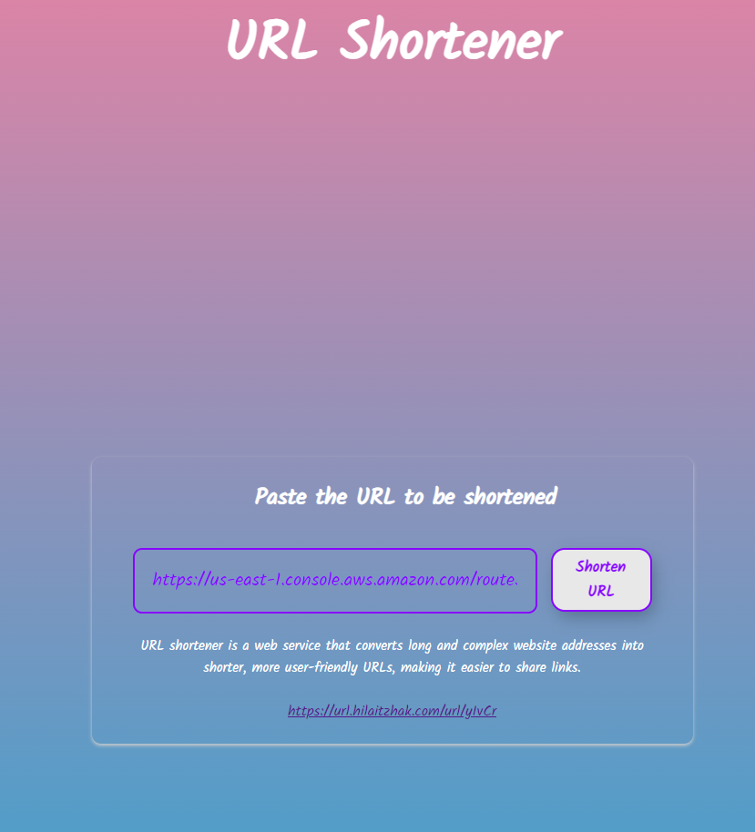

Short URL Generator
=============================================

This is a Node.js project that includes both a backend and a frontend for generating short URLs. The project consists of two main services: "backend" and "frontend".

Backend Directory:
------------------

The "backend" directory contains an Express server with two endpoints running on port 3001.

Endpoints:

1. POST /url/shorten: This endpoint allows you to shorten a long URL. You can send a POST request to this endpoint with the long URL as the payload, and it will return a shortened version of the URL.

Request:
``` bash
curl --location 'http://localhost:3001/url/shorten' \
--header 'Content-Type: application/json' \
--data '{
    "url": "https://www.youtube.com/watch?v=7EmboKQH8lM&list=PLmmYSbUCWJ4x1GO839azG_BBw8rkh-zOj"
}'
```
Response:
```json
{"url":"http://localhost:3001/De3Ej"}
```

2. GET /:short_str: This endpoint allows you to access the original long URL by providing the shortened string as a parameter. Sending a GET request to this endpoint with the shortened string will redirect you to the original long URL.

Request:
``` bash
curl  'http://localhost:3001/De3Ej'
```

Response:
```bash
Found. Redirecting to https://www.youtube.com/watch?v=7EmboKQH8lM&list=PLmmYSbUCWJ4x1GO839azG_BBw8rkh-zOj
```

Frontend Structure:
-------------------

The "frontend" application contains a React project with the following components:

- `<app>`:
    - The main component that acts as the root of the application.
    - `<header>`: The header section of the application.
    - `<content>`: The content section of the application.
        - `<main>`: The main content area.
            - `<input>`: An input field where the user can enter the long URL they want to shorten.
            - `<button>`: A button to trigger the URL shortening process.
            - `<output>`: An output area to display the shortened URL after generation.
    - `<footer>`: The footer section of the application.

Getting Started:
----------------

To run the project locally, follow these steps:

1. Clone the repository:
   git clone https://github.com/hilaitzhak/URL_Shortener.git

2. Navigate to the "backend" directory:
    ``` bash
    cd backend
    ```

3. Install backend dependencies:
    ``` bash
    npm install
    ```

4. Create server config:
    
    path:
    ```
    backend/config.json
    ```

    Server config example:
    ```json
    {
        "port": 3001,
        "base_redirect_url": "http://localhost:3001/url",
        "db": {
            "host": "localhost",
            "user": "root",
            "password": "root",
            "multipleStatements": true,
            "waitForConnections": true,
            "connectionLimit": 10,
            "enableKeepAlive": true,
            "keepAliveInitialDelay": 0,
            "charset": "utf8mb4",
            "database": "url_shortner"
        }
    }
    ```

5. Start the backend server:
    ``` bash
    npm start
    ```

  > **The backend server will be running on port 3001 (Default value).**

6. Open a new terminal window, navigate to the "frontend" directory, and install frontend dependencies:
    ``` bash
    cd frontend
    npm install
    ```

7. Start the frontend development server:
    ``` bash
    npm start
    ```

The frontend development server will be running on port 3000, and your default web browser will open automatically to display the application.

Dependencies:
-------------

The following are the main dependencies used in this project:

Backend:
```
    "cors": "2.8.5",
    "express": "4.18.2",
    "mysql2": "3.6.0",
    "nanoid": "3.3.6"
```

Frontend:
```
    "@testing-library/jest-dom": "5.17.0",
    "@testing-library/react": "13.4.0",
    "@testing-library/user-event": "13.5.0",
    "@types/jest": "27.5.2",
    "@types/node": "16.18.39",
    "@types/react": "18.2.17",
    "@types/react-dom": "18.2.7",
    "@types/valid-url": "^1.0.4",
    "axios": "^1.4.0",
    "react": "18.2.0",
    "react-dom": "18.2.0",
    "react-scripts": "5.0.1",
    "sass": "1.64.1",
    "typescript": "4.9.5",
    "valid-url": "1.0.9",
    "web-vitals": "2.1.4"
```


---


Screenshots:
-------------


---
Happy URL Shortening! If you have any questions or feedback, please don't hesitate to contact me.

Contributors:
- Hila Itzhak (https://github.com/hilaitzhak)

---